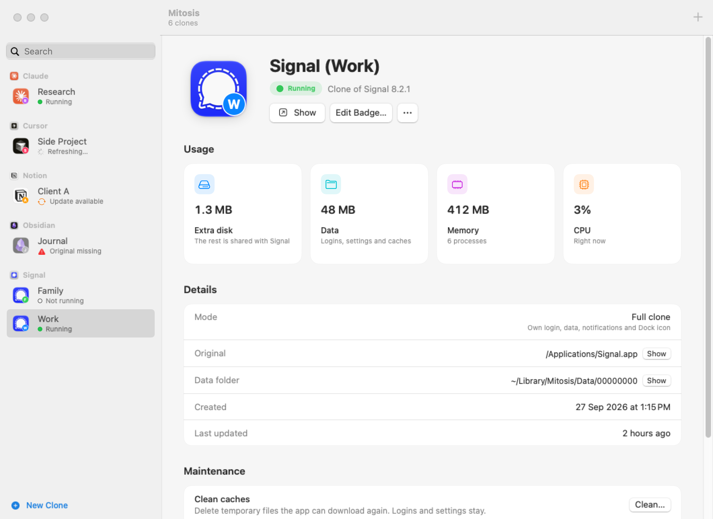
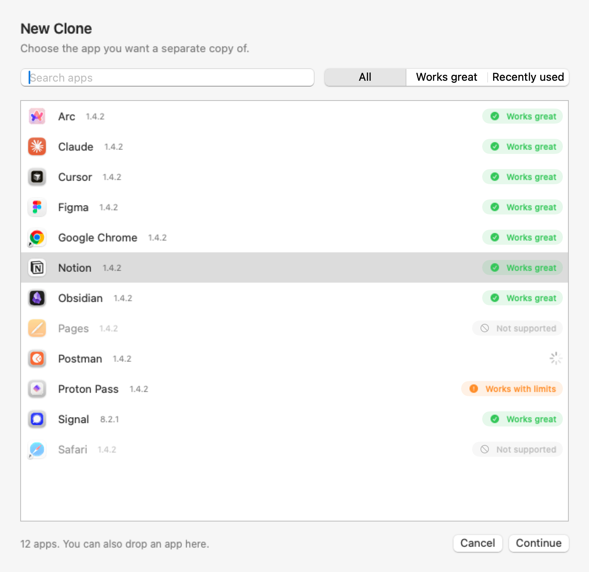
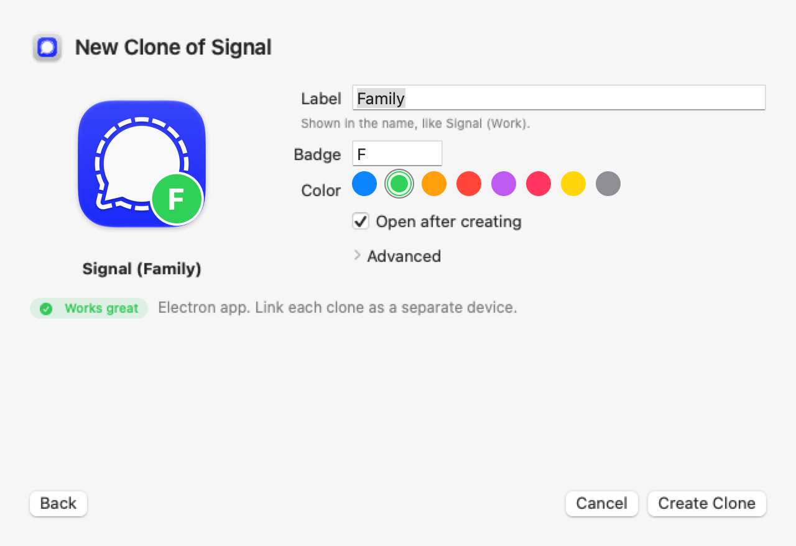
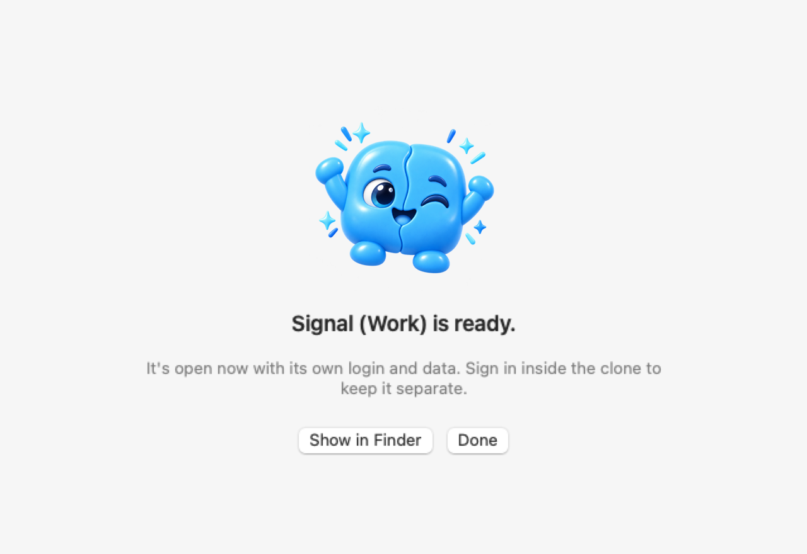

<p align="center">
  
</p>

<h1 align="center">Mitosis</h1>

<p align="center">
  <b>Run separate copies of your Mac apps, side by side.</b><br>
  One login per copy. One Dock icon per copy. Nothing mixed up.
</p>

<p align="center">
  <a href="https://github.com/deadhearth01/Mitosis/releases/latest"></a>
  <a href="https://github.com/deadhearth01/Mitosis/releases"></a>
  <a href="https://github.com/deadhearth01/Mitosis/actions/workflows/ci.yml"></a>
  
  
  
  <a href="LICENSE"></a>
  <a href="https://github.com/deadhearth01/Mitosis/stargazers"></a>
</p>

<p align="center">
  <a href="#install"></a>
  &nbsp;
  <a href="https://github.com/deadhearth01/Mitosis/releases/latest"></a>
</p>

<p align="center">
  <picture>
    <source media="(prefers-color-scheme: dark)" srcset="Assets/Screenshots/clone-dark.png">
    
  </picture>
</p>

<p align="center">
  <a href="#features">Features</a> ·
  <a href="#install">Install</a> ·
  <a href="#quick-start">Quick start</a> ·
  <a href="#which-apps-work">Which apps work</a> ·
  <a href="#how-it-works">How it works</a> ·
  <a href="#faq">FAQ</a> ·
  <a href="#roadmap">Roadmap</a> ·
  <a href="#contributing">Contributing</a> ·
  <a href="https://mitosis.theavni.studio/">Website</a>
</p>

## Features

- **Separate logins.** Sign in to a different account in every copy: Slack (Work) and Slack (Personal), side by side.
- **Separate data.** Settings, chats, and caches stay with their own copy and never touch the original.
- **Separate Dock icons.** Each copy gets a small badge (letters or an emoji), so you can tell them apart at a glance.
- **Open in any order.** Start the original or any copy first; they all run at the same time.
- **Updates on its own.** When the original app updates, Mitosis rebuilds its copies in the background, even while Mitosis is closed. Logins and data stay.
- **Light on your Mac.** Copies share the original's files on disk (APFS cloning), so a copy usually costs a couple of megabytes. Mitosis itself idles at about 45 MB of memory and no CPU.
- **Stats for every copy.** See the extra disk space, data size, memory, and CPU each copy uses, and clean its caches without losing logins.
- **Guided and checked.** Pick an app, add a label, done. Every new copy is opened once to make sure it really starts; one that doesn't is removed, and a failed update restores the previous version.
- **Native and private.** Built in SwiftUI, with a help guide, menu bar access, and a `mitosis` command. No accounts, no analytics; the only network request is an optional update check.
- **Safe by design.** The original app is never modified. Deleting moves things to the Trash; nothing is erased permanently.

## Install

Paste this in Terminal:

```bash
curl -fsSL https://raw.githubusercontent.com/deadhearth01/Mitosis/main/scripts/install.sh | bash
```

The installer downloads the newest release, **verifies its SHA-256 checksum and signature**, puts Mitosis in `/Applications`, links the `mitosis` command into `~/.local/bin`, and opens the app. No admin password needed. Run it again any time to update.

> Requires macOS 15 or later on an Apple silicon Mac.

<details>
<summary><b>Other ways to install</b></summary>

**Homebrew:**

```bash
brew install --cask deadhearth01/tap/mitosis
```

**Manual download:** get `Mitosis-<version>.zip` from the [latest release](https://github.com/deadhearth01/Mitosis/releases/latest), check it against the `.sha256` file, unzip it, and move `Mitosis.app` to Applications. Mitosis isn't notarized (see the [FAQ](#faq)), so macOS blocks a browser-downloaded copy the first time; clear that once with:

```bash
xattr -dr com.apple.quarantine /Applications/Mitosis.app
```

**Build from source** (Xcode 26 or later):

```bash
git clone https://github.com/deadhearth01/Mitosis.git
cd Mitosis
scripts/build-app.sh        # builds dist/Mitosis.app
swift test                  # runs the test suite
```

</details>

<details>
<summary><b>Uninstall</b></summary>

1. Delete your clones first if you like: select one in Mitosis and choose **Delete…** (it goes to the Trash).
2. In Mitosis, turn off **Settings ▸ General ▸ Update clones automatically** (this removes the background updater), then quit Mitosis.
3. Move `Mitosis.app` to the Trash and remove the command:

```bash
rm -f ~/.local/bin/mitosis
```

Clones live in `~/Applications/Mitosis/` and their data in `~/Library/Mitosis/`, so you can also remove those folders yourself. With Homebrew: `brew uninstall --cask mitosis`.

</details>

## Quick start

1. Open Mitosis and click **New Clone** (⌘N), or drag an app onto the window.
2. Pick the app. Each one shows whether it **Works great**, **works with limits**, or isn't supported yet.
3. Add a label like **Work**. Mitosis names the copy `Slack (Work)`, draws its badge, and checks that it starts.
4. Sign in inside the clone. It's a separate app now: keep it in the Dock, give it its own notifications, open it next to the original.

<table>
  <tr>
    <td></td>
    <td></td>
    <td></td>
  </tr>
</table>

Prefer Terminal? The same engine is available as `mitosis`:

```bash
mitosis doctor Slack                  # can Slack be cloned, and how?
mitosis clone Slack --label Work      # creates "Slack (Work)" and checks that it starts
mitosis list                          # your clones, and whether any need a refresh
mitosis stats "Slack (Work)"          # extra disk, data, RAM, and CPU for one clone
mitosis clean "Slack (Work)"          # delete caches; logins and settings stay
mitosis refresh --all                 # rebuild clones after their original app updates
mitosis delete "Slack (Work)"         # move the clone to the Trash (data kept unless --delete-data)
```

## Which apps work?

| | Examples | What you get |
|---|---|---|
| ✅ **Works great** | Slack, Discord, Signal, VS Code, Obsidian, Notion, Claude, most Electron and Chromium apps | Separate login, data, Dock icon, and notifications |
| ⚠️ **Works with limits** | Some apps with system extensions or shared keychains | Mitosis explains what won't work before you clone |
| ⏳ **Not yet** | Sandboxed apps that need iCloud or shared app data (for example WhatsApp) | A "light mode" for these is planned |
| 🚫 **Not supported** | Apple's own apps | They're part of macOS and protected by it |

Run `mitosis doctor <App>` to see exactly how an app will be cloned. Tried an app? [Tell us how it went](https://github.com/deadhearth01/Mitosis/issues/new?template=app_compatibility.yml).

## How it works

1. **Copy without copying.** Mitosis makes an APFS clone of the app in `~/Applications/Mitosis/`. Unchanged files share the original's disk blocks.
2. **New identity.** The copy gets its own bundle ID and name (`Slack (Work)`), so macOS treats it as a separate app with its own Dock icon, notifications, and permissions.
3. **Own data folder.** A tiny launcher starts the app with its own data folder in `~/Library/Mitosis/Data/`, so logins never mix.
4. **Signed on your Mac.** Only the files Mitosis changed are re-signed, with a local ad-hoc signature; the app's original signatures stay intact.
5. **Verified.** The copy is opened once to confirm it starts before Mitosis reports success.
6. **Kept up to date.** A small background job watches the original apps (no CPU while waiting) and rebuilds their copies after an update. Open copies wait until you quit them.

Apps that can't take a new identity use a compatibility mode that runs the original app with a separate data folder.

## FAQ

<details>
<summary><b>Why does macOS ask for permissions again in a clone?</b></summary>

macOS sees each clone as a new app, so it asks again for notifications, files, the camera, and similar access. That's expected and keeps each copy's permissions separate.
</details>

<details>
<summary><b>What happens when the original app updates?</b></summary>

Mitosis rebuilds its clones automatically, in the background, keeping your logins and data. A clone that's open is rebuilt after you quit it. You can turn this off in Settings and refresh by hand instead.
</details>

<details>
<summary><b>How much disk space does a clone use?</b></summary>

Usually a couple of megabytes, because a clone shares the original's files. That only works when the original app is on the same drive as your home folder; otherwise Mitosis warns you before making a full copy. `mitosis stats` shows the real numbers.
</details>

<details>
<summary><b>Does Mitosis change the original app?</b></summary>

Never. All changes happen on the copy.
</details>

<details>
<summary><b>Is it safe? Why isn't it notarized?</b></summary>

Mitosis is free and built without a paid Apple Developer account, so it can't be notarized. The install script and the Homebrew cask download it in a way macOS doesn't block, and the script verifies the checksum and signature. All source code is here to read, and clones are signed locally on your Mac.
</details>

<details>
<summary><b>Can I use it at work?</b></summary>

Yes. Mitosis is free for any use, including at work. What you can't do is sell it or use its source code in commercial or paid products. See [License](#license).
</details>

## Roadmap

- [x] Clone engine with identity and compatibility modes
- [x] Launch check, safe refresh with automatic restore, delete to Trash
- [x] Per-clone stats and cache cleaning
- [x] Native Mac app: guided New Clone flow, clone pages with stats, help guide, menu bar
- [x] Automatic clone updates when the original app updates
- [x] `mitosis` command, one-line installer, Homebrew tap
- [ ] Workspaces: open a set of clones together
- [ ] Login router: sign-in links open in the clone that asked for them
- [ ] Light mode for sandboxed apps (WhatsApp and similar)
- [ ] Notarized builds

See [CHANGELOG.md](CHANGELOG.md) for what's new in each release.

## Contributing

Bug reports, [app compatibility reports](https://github.com/deadhearth01/Mitosis/issues/new?template=app_compatibility.yml), and pull requests are welcome. Start with [CONTRIBUTING.md](CONTRIBUTING.md), and please follow the [Code of Conduct](CODE_OF_CONDUCT.md). Found a security problem? Please report it privately; see [SECURITY.md](SECURITY.md).

## License

Mitosis is **free and source-available** under the [PolyForm Noncommercial License 1.0.0](LICENSE), with one extra permission: **anyone may use Mitosis itself for any purpose, including at work.**

You may not sell Mitosis or use its source code in commercial or paid products. The Mitosis name, icon, and the Mito mascot are not covered by the license, so forks need their own name and icon.

## Star history

<a href="https://star-history.com/#deadhearth01/Mitosis&Date">
  
</a>

---

<p align="center">
  <br>
  Made with care by <a href="https://theavni.studio/labs">The Avni Studio Labs</a>.
</p>
