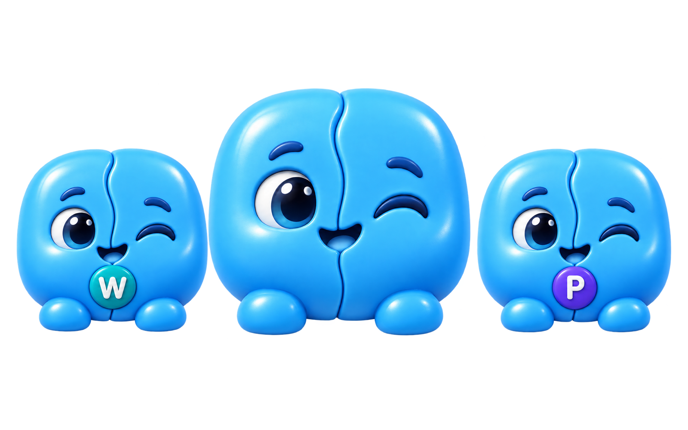

<p align="center">
  
</p>

<h1 align="center">Mitosis</h1>

<p align="center">
  <b>Run separate copies of your Mac apps, side by side.</b><br>
  One login per copy. One Dock icon per copy. Nothing mixed up.
</p>

<p align="center">
  <a href="https://github.com/deadhearth01/Mitosis/releases"></a>
  <a href="https://github.com/deadhearth01/Mitosis/releases"></a>
  
  
  
  <a href="LICENSE"></a>
  <a href="https://github.com/deadhearth01/Mitosis/stargazers"></a>
</p>

<p align="center">
  <a href="#install"></a>
  &nbsp;
  <a href="https://github.com/deadhearth01/Mitosis/releases"></a>
</p>

<p align="center">
  
</p>

> [!NOTE]
> Mitosis is in early development. **Available today:** the `mitosis` command-line tool (0.1.0-alpha.1 preview). **Coming in 0.1:** the native Mac app with guided onboarding, per-clone stats, and a built-in help guide.

<p align="center">
  <a href="#features">Features</a> ·
  <a href="#install">Install</a> ·
  <a href="#quick-start">Quick start</a> ·
  <a href="#which-apps-work">Which apps work</a> ·
  <a href="#how-it-works">How it works</a> ·
  <a href="#faq">FAQ</a> ·
  <a href="#roadmap">Roadmap</a> ·
  <a href="#contributing">Contributing</a>
</p>

## Features

- **Separate logins.** Sign in to a different account in every copy: Slack (Work) and Slack (Personal), side by side.
- **Separate data.** Settings, chats, and caches stay with their own copy and never touch the original.
- **Separate Dock icons.** Each copy gets a small badge, so you can tell them apart at a glance.
- **Open in any order.** Start the original or any copy first; they all run at the same time.
- **Light on your Mac.** Copies share the original's files on disk (APFS cloning), so a copy usually costs a couple of megabytes.
- **Checks before it says "done".** Every new copy is opened once to make sure it really starts. A copy that doesn't start is removed, and a failed update restores the previous version.
- **Stats for every copy.** See the extra disk space, data size, RAM, and CPU each copy uses, and clean its caches without losing logins.
- **Safe by design.** The original app is never modified. Deleting moves things to the Trash; nothing is erased permanently.
- **Private.** No accounts, no analytics. The clone engine makes no network connections.

## Install

Paste this in Terminal:

```bash
curl -fsSL https://raw.githubusercontent.com/deadhearth01/Mitosis/main/scripts/install.sh | bash
```

The installer downloads the newest release, **verifies its SHA-256 checksum**, and installs `mitosis` to `~/.local/bin` for your user only. No admin password needed.

> Requires macOS 15 or later on an Apple silicon Mac.

<details>
<summary><b>Other ways to install</b></summary>

**Homebrew:** coming with the Mac app in 0.1.

**Manual download:** grab `mitosis-macos-arm64.tar.gz` from the [releases page](https://github.com/deadhearth01/Mitosis/releases), check it against the `.sha256` file, and keep the files in the `mitosis` folder together. If you download it with a browser, macOS quarantines it; the install script above avoids that.

**Build from source** (Xcode 16 or later):

```bash
git clone https://github.com/deadhearth01/Mitosis.git
cd Mitosis
swift build -c release
.build/release/mitosis --help
```

</details>

<details>
<summary><b>Uninstall</b></summary>

1. Delete your clones first if you like: `mitosis delete "Slack (Work)" --delete-data` (they go to the Trash).
2. Remove the tool:

```bash
rm -rf ~/.local/share/mitosis ~/.local/bin/mitosis
```

Clones live in `~/Applications/Mitosis/` and their data in `~/Library/Mitosis/`, so you can also remove those folders yourself.

</details>

## Quick start

```bash
mitosis doctor Slack                  # can Slack be cloned, and how?
mitosis clone Slack --label Work      # creates "Slack (Work)" and checks that it starts
mitosis list                          # your clones, and whether any need a refresh
mitosis stats "Slack (Work)"          # extra disk, data, RAM, and CPU for one clone
mitosis clean "Slack (Work)"          # delete caches; logins and settings stay
mitosis refresh --all                 # rebuild clones after their original app updates
mitosis delete "Slack (Work)"         # move the clone to the Trash (data kept unless --delete-data)
```

Clone names always follow `App (Label)`, so a copy never looks like a different app. Add `--badge` and `--color` to style the Dock badge, and run `mitosis help clone` for every option.

## Which apps work?

| | Examples | What you get |
|---|---|---|
| ✅ **Works great** | Slack, Discord, Signal, VS Code, Obsidian, Notion, Claude, most Electron and Chromium apps | Separate login, data, Dock icon, and notifications |
| ⚠️ **Works with limits** | Some apps with system extensions or shared keychains | Mitosis explains what won't work before you clone |
| ⏳ **Not yet** | Sandboxed apps that need iCloud or shared app data (for example WhatsApp) | A "light mode" for these is planned |
| 🚫 **Not supported** | Apple's own apps | They're part of macOS and protected by it |

Run `mitosis doctor <App>` to see exactly how an app will be cloned. Tried an app? [Tell us how it went](https://github.com/deadhearth01/Mitosis/issues/new?template=app_compatibility.yml).

## How it works

1. **Copy without copying.** Mitosis makes an APFS clone of the app in `~/Applications/Mitosis/`. Unchanged files share the original's disk blocks.
2. **New identity.** The copy gets its own bundle ID and name (`Slack (Work)`), so macOS treats it as a separate app with its own Dock icon, notifications, and permissions.
3. **Own data folder.** A tiny launcher starts the app with its own data folder in `~/Library/Mitosis/Data/`, so logins never mix.
4. **Signed on your Mac.** Only the files Mitosis changed are re-signed, with a local ad-hoc signature; the app's original signatures stay intact.
5. **Verified.** The copy is opened once to confirm it starts before Mitosis reports success.

Apps that can't take a new identity use a compatibility mode that runs the original app with a separate data folder.

## FAQ

<details>
<summary><b>Why does macOS ask for permissions again in a clone?</b></summary>

macOS sees each clone as a new app, so it asks again for notifications, files, the camera, and similar access. That's expected and keeps each copy's permissions separate.
</details>

<details>
<summary><b>What happens when the original app updates?</b></summary>

`mitosis list` shows "update available". Run `mitosis refresh "Slack (Work)"` (or `--all`). Your logins and data stay. If the refreshed copy doesn't start, Mitosis restores the previous version.
</details>

<details>
<summary><b>How much disk space does a clone use?</b></summary>

Usually a couple of megabytes, because a clone shares the original's files. That only works when the original app is on the same drive as your home folder; otherwise Mitosis warns you before making a full copy. `mitosis stats` shows the real numbers.
</details>

<details>
<summary><b>Does Mitosis change the original app?</b></summary>

Never. All changes happen on the copy.
</details>

<details>
<summary><b>Is it safe? Why isn't it notarized?</b></summary>

Mitosis is free and built without a paid Apple Developer account, so it can't be notarized. The installer verifies a checksum, and all source code is here to read. Clones are signed locally on your Mac.
</details>

<details>
<summary><b>Can I use it at work?</b></summary>

Yes. Mitosis is free for any use, including at work. What you can't do is sell it or use its source code in commercial or paid products. See [License](#license).
</details>

## Roadmap

- [x] Clone engine with identity and compatibility modes
- [x] Launch check, safe refresh with automatic restore, delete to Trash
- [x] Per-clone stats and cache cleaning
- [x] `mitosis` command-line tool and one-line installer
- [ ] **0.1:** Native Mac app with guided onboarding, app picker, stats panel, and help guide
- [ ] Homebrew tap
- [ ] Menu bar access to your clones
- [ ] Workspaces: open a set of clones together
- [ ] Light mode for sandboxed apps (WhatsApp and similar)

See [CHANGELOG.md](CHANGELOG.md) for what's new in each release.

## Contributing

Bug reports, [app compatibility reports](https://github.com/deadhearth01/Mitosis/issues/new?template=app_compatibility.yml), and pull requests are welcome. Start with [CONTRIBUTING.md](CONTRIBUTING.md), and please follow the [Code of Conduct](CODE_OF_CONDUCT.md). Found a security problem? Please report it privately; see [SECURITY.md](SECURITY.md).

## License

Mitosis is **free and source-available** under the [PolyForm Noncommercial License 1.0.0](LICENSE), with one extra permission: **anyone may use Mitosis itself for any purpose, including at work.**

You may not sell Mitosis or use its source code in commercial or paid products. The Mitosis name, icon, and the Mito mascot are not covered by the license, so forks need their own name and icon.

## Star history

<a href="https://star-history.com/#deadhearth01/Mitosis&Date">
  
</a>

---

<p align="center">
  <br>
  Made with care by <a href="https://theavni.studio/labs">The Avni Studio Labs</a>.
</p>
